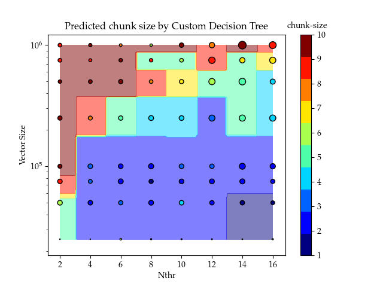
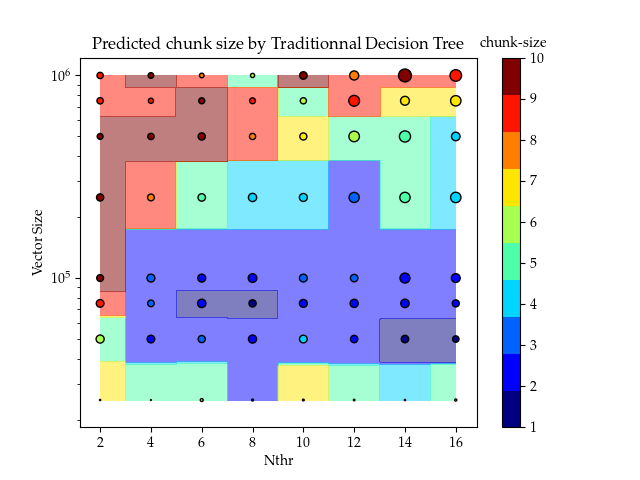

# Full Data Set

In this folder, Data is analyzed and machine learning algorihms are fitted. 

1. featureAnalysis.py (contains correlation analysis and vizualization of the data set to help understand the relationshop between the features and the optimal chunk-size)

1. blackBoxClasses.py (contains the PreTO and PosTO models that are described in the paper) 

1. CustomTree.py (contains the custom decision tree described in the paper which maximizes the MSOP on the training set)

1. crossvalid.py (contains function used for cross validation used for model selection)

1. ShuffledAssessement.py (Shuffles the data set and generates a train and test set. The training set is used to select a Model. The Selected Model is then used on the test set. Finally, a header containing the decision tree can be computed and put in BlazeML/Models/)


## Machine Learning Models
### PosTO and PreTO models
Both models are wrapped around a scikit-learn model
https://scikit-learn.org/stable/.
The objects must be called with a scikit model as an input.
```
preBlackBoxObject = PreTrainingOptimisationModel(scikitModel, standardized, weighted)
```
where standardize and weighted are booleans which tells if the model must use standardization of features and if weighted MSOP is used.

Hyperparameters of the underlying machine learning model can be changed via 
```
preBlackBoxObject.setHyperParams({"hyper_param1" : value, "hyper_param2" : value})
```

Models are trained on a given data set with the function
```
preBlackBoxObject.train(Xdata, Mflops, targets)
```
Predictions and prediction times in micro-seconds on a new data set can be computed with
```
preBlackBoxObject.predict(Xdata)
```

To compute the accuracies and MSOP of a given set of predictions predCS the function score can be called
```
preBlackBoxObject.score(predCs, Mflops, targets)
```

Finally, the member function evaluate is going to apply both predict and score to get the score of the model on a arbitrary test set.
```
preBlackBoxObject.evaluate(Xdata, Mflops, targets)
```

## Custom Decision Tree Classifier

This custom tree Minimizes the MSOP on the training set, which is different from how trees are implemented in scikit-learn so we had to implement it.

It shares the same interface as the PreTO and PosTO models except for the constructor
```
customBlackBoxdtf = CustomDecisionTree(max_depth, min_samples_split, max_MSOP, weighted)
```
where the hyperparameters are

1. max_depth (maximal depth of the tree)
1. min_samples_split (minimal number of samples to split a leaf)
1. max_MSOP (maximal MSOP of a node to consider a split)

The advantage of the Cumstom Decision Tree is that it results in less complex models because the model is able to put more efforts in regions of the input space where chunk-size had a bigger impact on performance. Next figures illustrate that fact:






Each point represents an experiement in the training set. The size of the circles are propotionnal to the relative variance of performance with respect to chunk-size for every experiement. In other words, the largest the circle, the more important it is to predict its chunk-size correctly. For small circles, it doesn't really matter what chunk-size is predicted. We see that the custom decision tree results in a less complex tree because it is able to focus on experiments where the prediction of chunk-size matters more. Traditionnal classification trees will try to accuratelly predict every chunk-size regardless of the importance of predicting the rigth one.
